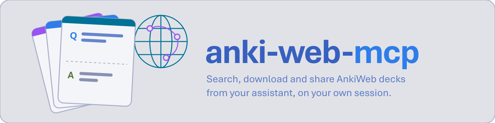
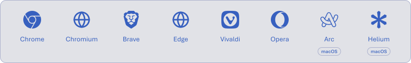
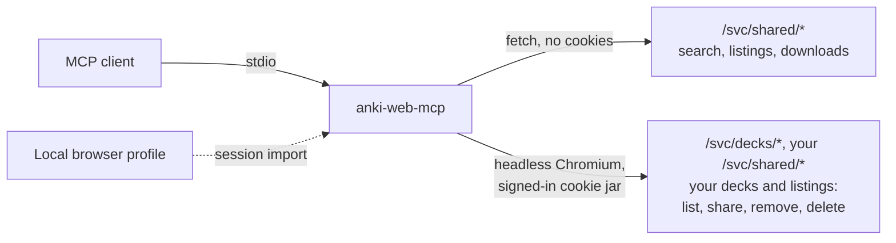

<div align="center">

<picture>
  <source media="(prefers-color-scheme: dark)" srcset="assets/banner/banner-dark.svg">
  
</picture>

[![npm][npm-badge]][npm]
[![CI][ci-badge]][ci]
[![License][license-badge]][license]
[![Node][node-badge]][node]

---

<a href="#install"><picture><source media="(prefers-color-scheme: dark)" srcset="assets/nav/install-dark.svg"></picture></a><a href="#sign-in"><picture><source media="(prefers-color-scheme: dark)" srcset="assets/nav/sign-in-dark.svg"></picture></a><a href="#tools"><picture><source media="(prefers-color-scheme: dark)" srcset="assets/nav/tools-dark.svg"></picture></a><a href="#how-it-works"><picture><source media="(prefers-color-scheme: dark)" srcset="assets/nav/how-it-works-dark.svg"></picture></a><a href="#more"><picture><source media="(prefers-color-scheme: dark)" srcset="assets/nav/docs-dark.svg"></picture></a>

---

</div>

<div align="center">
<picture>
  <source media="(prefers-color-scheme: dark)" srcset="assets/demo/demo-dark.svg">
  
</picture>
</div>

MCP server for [AnkiWeb](https://ankiweb.net), gives an AI agents the shared-deck catalogue and the decks synced to your account, with no Anki desktop app running.

- Search shared decks and read a listing: description, sample notes, reviews.
- Download a shared deck's `.apkg`, and convert it to Markdown the assistant can read.
- List the decks synced to your account, with due counts.
- Share one of your decks publicly, only after you have seen a preview and said yes.
- Reuse the AnkiWeb session already signed in to your browser.

It is not affiliated with AnkiWeb or Ankitects.
AnkiWeb's terms do not allow third-party clients and say it can suspend access at its discretion; [docs/ankiweb.md](docs/ankiweb.md#terms-of-service) quotes the clause.
AnkiWeb licenses shared decks for personal use only.

## Why this project?

Most Anki MCP servers go through [AnkiConnect](https://ankiweb.net/shared/info/2055492159), an add-on that exposes the collection of a running Anki desktop app.
That is the right tool for editing your own cards.
It cannot see the shared catalogue, which lives only on AnkiWeb.

|                                  | AnkiConnect servers | anki-web-mcp |
| -------------------------------- | ------------------- | ------------ |
| Needs Anki desktop running       | yes                 | no           |
| Search and download shared decks | no                  | yes          |
| Share a deck publicly            | no                  | yes          |
| List your synced decks           | yes                 | yes          |
| Add, edit or review cards        | yes                 | no           |

## Install

Add the server to your MCP client's configuration:

```json
{
  "mcpServers": {
    "anki-web": {
      "command": "npx",
      "args": ["anki-web-mcp@latest"]
    }
  }
}
```

The server answers its client in under half a second. With `@latest`, `npx`
first asks the npm registry for the newest version, every time the client
starts it, which can leave the server still connecting after the others have
loaded. To skip that, run `npm install -g anki-web-mcp` and use
`"command": "anki-web-mcp"` with no `args`, upgrading by hand.

Then download the Chromium build the server drives:

```sh
npx anki-web-mcp@latest --install-browser
```

Searching and downloading shared decks work from here, with no account.

## Sign in

Listing your decks and sharing one need an AnkiWeb session.
The first call that needs one looks for it in a local browser where you are signed in to AnkiWeb:

<picture>
  <source media="(prefers-color-scheme: dark)" srcset="assets/browsers/browsers-dark.svg">
  
</picture>

On macOS that shows one keychain prompt per browser it tries.
If no browser has a session, sign in once in a window the server opens:

```sh
npx anki-web-mcp@latest --login
```

You type your password into AnkiWeb's own page, so it never passes through the server.
The session stays in `~/.local/state/anki-web-mcp/` on Linux and in `~/.anki-web-mcp/` elsewhere,
created `0700`, and `--logout` deletes it.
[docs/cli.md](docs/cli.md) lists every flag.

## Tools

| tool                       | does                                                      |
| -------------------------- | --------------------------------------------------------- |
| `search_shared_decks`      | searches the shared catalogue, with sorting and paging    |
| `get_shared_deck`          | one listing: description, tags, sample notes, reviews     |
| `download_shared_deck`     | saves a shared deck's `.apkg`, never overwriting a file   |
| `convert_deck_to_markdown` | turns a local `.apkg` into Flashcard Markdown and images  |
| `list_my_decks`            | the decks synced to your account, with due counts         |
| `list_my_shared_decks`     | the decks you have shared, with downloads and ratings     |
| `share_deck`               | publishes one of your decks to the shared catalogue       |
| `unshare_deck`             | takes one of your listings off the shared catalogue       |
| `delete_deck`              | deletes one of your decks, and its subdecks and cards     |
| `server_status`            | version, data directory, and whether the session is valid |
| `close_session`            | closes the headless browser until the next call needs it  |

`convert_deck_to_markdown` writes [Flashcard Markdown](https://github.com/shbernal/flashcard-md-spec) through [`@ankimd/core`](https://www.npmjs.com/package/@ankimd/core), and reports what did not convert.

### Changes ask first

`share_deck` publishes under your account, so it takes two calls.
Without `confirm: true` it only returns a preview, and the assistant is told to show it to you and wait.
Removing a listing with `unshare_deck` and deleting a deck with `delete_deck` ask the same way.

<picture>
  <source media="(prefers-color-scheme: dark)" srcset="assets/share/share-dark.svg">
  
</picture>

Confirming also makes AnkiWeb's declaration that you own the material or have a license to share it.

### Read-only

Start the server with `--read-only`, or `ANKI_WEB_MCP_READ_ONLY=1`, and it lists no tool that changes anything on AnkiWeb, so `share_deck`, `unshare_deck` and `delete_deck` are not offered at all ([docs/cli.md](docs/cli.md)):

```json
{ "command": "npx", "args": ["anki-web-mcp@latest", "--read-only"] }
```

### Several accounts

One server can act as more than one AnkiWeb account. Sign each extra one in under a name of your choosing:

```sh
npx anki-web-mcp@latest --login --account work
```

Then ask for it by name ("list the decks on my work account").
Calls that name no account use the one signed in with plain `--login`, or the one `--account` gives the server.
`npx anki-web-mcp@latest --status` checks them all.

## How it works

AnkiWeb is a single-page app whose data comes from protobuf endpoints under `/svc/`.
The server calls those endpoints directly and renders no pages.



- Shared-deck reads go out without cookies, cached for as long as AnkiWeb allows: ten minutes.
- After a few anonymous downloads AnkiWeb asks for a login, and the download is retried with your session, from its stored cookie when that is enough.
- Calls on your account go through one headless browser, one at a time, closed after five idle minutes.
- Requests are spaced at least a second apart, since AnkiWeb answers `429` after about four searches a minute.

## More

- [docs/cli.md](docs/cli.md): every command-line flag
- [docs/session.md](docs/session.md): the data directory, signing in, browser import
- [docs/shared-decks.md](docs/shared-decks.md): search, details, downloads and conversion to Markdown
- [docs/sharing.md](docs/sharing.md): the share flow, removing a listing, and their confirmation
- [docs/deleting.md](docs/deleting.md): deleting a deck, and its stricter confirmation
- [docs/errors.md](docs/errors.md): what a failing tool returns, and request pacing
- [docs/ankiweb.md](docs/ankiweb.md): every AnkiWeb endpoint used, as observed
- [CONTRIBUTING.md](CONTRIBUTING.md): setup, gates, and what to update when AnkiWeb changes
- [NOTICE](NOTICE): the browser import is ported from [linkedin-mcp-server](https://github.com/stickerdaniel/linkedin-mcp-server)

[npm]: https://www.npmjs.com/package/anki-web-mcp
[npm-badge]: https://img.shields.io/npm/v/anki-web-mcp?style=for-the-badge&logo=npm&logoColor=f7768e&labelColor=1a1b26&color=f7768e
[ci]: https://github.com/shbernal/anki-web-mcp/actions/workflows/ci.yml
[ci-badge]: https://img.shields.io/github/actions/workflow/status/shbernal/anki-web-mcp/ci.yml?branch=main&style=for-the-badge&logo=githubactions&logoColor=9ece6a&label=CI&labelColor=1a1b26&color=9ece6a
[license]: LICENSE
[license-badge]: https://img.shields.io/github/license/shbernal/anki-web-mcp?style=for-the-badge&labelColor=1a1b26&color=e0af68
[node]: https://nodejs.org
[node-badge]: https://img.shields.io/badge/node-%E2%89%A524-7aa2f7?style=for-the-badge&logo=nodedotjs&logoColor=7aa2f7&labelColor=1a1b26
