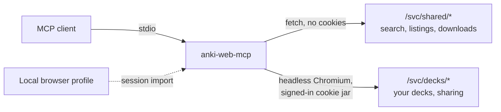

<div align="center">

# anki-web-mcp

Search, download and share AnkiWeb decks from your assistant, on your own session.

[![CI][ci-badge]][ci]
[![License][license-badge]][license]
[![Node][node-badge]][node]

---

[Install](#install) • [Sign in](#sign-in) • [Tools](#tools) • [How it works](#how-it-works) • [Docs](#more)

---

</div>

<!-- Demo: record an assistant session that searches shared decks, downloads one, and previews a share. -->

anki-web-mcp is an MCP server for [AnkiWeb](https://ankiweb.net).
It gives an assistant such as Claude the shared-deck catalogue and the decks synced to your account.

- Search shared decks and read a listing: description, sample notes, reviews.
- Download a shared deck's `.apkg` to disk.
- List the decks synced to your account.
- Share one of your decks publicly, only after you have seen a preview and said yes.
- Reuse the AnkiWeb session already signed in to Chrome, Brave, Edge and other Chromium browsers.

It is not affiliated with AnkiWeb or Ankitects.
AnkiWeb's terms do not allow third-party clients, and say it can suspend access at its discretion; [docs/ankiweb.md](docs/ankiweb.md#terms-of-service) quotes the clause.
AnkiWeb licenses shared decks for personal use only.

## Install

Add the server to your MCP client's configuration:

```json
{
  "mcpServers": {
    "anki-web": {
      "command": "npx",
      "args": ["anki-web-mcp@latest"]
    }
  }
}
```

Node.js 24 or newer is required.
Then download the Chromium build the server drives:

```sh
npx anki-web-mcp@latest --install-browser
```

Searching and downloading shared decks work at this point, with no account.

## Sign in

Listing your decks and sharing one need an AnkiWeb session.
The first call that needs one looks for it in a local Chromium-family browser where you are signed in to AnkiWeb: Chrome, Chromium, Brave, Edge, Vivaldi and Opera on Linux and macOS, plus Arc and Helium on macOS.
On macOS that shows one keychain prompt per browser it tries.

If no browser has a session, sign in once in a window the server opens:

```sh
npx anki-web-mcp@latest --login
```

You type your password into AnkiWeb's own page, so it never passes through the server.
The server keeps the session in `~/.anki-web-mcp/`, created `0700`, and writes the cookie export `0600`.
`--logout` deletes it.

## Tools

| tool                   | does                                                      |
| ---------------------- | --------------------------------------------------------- |
| `search_shared_decks`  | searches the shared catalogue, with sorting and paging    |
| `get_shared_deck`      | one listing: description, tags, sample notes, reviews     |
| `download_shared_deck` | saves a shared deck's `.apkg`, never overwriting a file   |
| `list_my_decks`        | the decks synced to your account, with due counts         |
| `share_deck`           | publishes one of your decks to the shared catalogue       |
| `server_status`        | version, data directory, and whether the session is valid |
| `close_session`        | closes the headless browser until the next call needs it  |

`share_deck` publishes publicly under your account.
Without `confirm: true` it only returns a preview, and the tool description tells the assistant to show you that preview and wait for your go-ahead.
Calling it with `confirm: true` also makes AnkiWeb's declaration that you own the material or have a license to share it.

## Command line

| flag                           | does                                                      |
| ------------------------------ | --------------------------------------------------------- |
| `--login`                      | signs in to AnkiWeb in a visible browser window           |
| `--logout`                     | deletes the stored session, keeping downloads             |
| `--import-from-browser [name]` | imports the session from a local browser now              |
| `--no-auto-import`             | never looks in local browsers on its own                  |
| `--install-browser`            | downloads Playwright's Chromium                           |
| `--channel <name>`             | drives an installed browser, such as `chrome`, instead    |
| `--data-dir <path>`            | keeps the session elsewhere; also `ANKI_WEB_MCP_DATA_DIR` |

Without `--login`, `--logout`, `--import-from-browser` or `--install-browser`, it serves MCP over stdio.

## How it works

AnkiWeb is a single-page app whose data comes from protobuf endpoints under `/svc/`.
The server calls those endpoints directly and renders no pages.



- Shared-deck reads go out without cookies, and the server caches each answer for as long as AnkiWeb allows, ten minutes.
- After a few anonymous downloads AnkiWeb asks for a login, and the server retries the download with your session.
- Calls on your account go through one headless browser, one at a time, which closes after five idle minutes.
- The server spaces requests at least a second apart. AnkiWeb answers `429` after about four searches a minute.

## More

- [docs/ankiweb.md](docs/ankiweb.md): every AnkiWeb endpoint used, as observed
- [docs/session.md](docs/session.md): the data directory, signing in, browser import
- [docs/shared-decks.md](docs/shared-decks.md): search, details and downloads
- [docs/sharing.md](docs/sharing.md): the share flow and its confirmation
- [docs/errors.md](docs/errors.md): what a failing tool returns, and request pacing
- [NOTICE](NOTICE): the browser import is ported from [linkedin-mcp-server](https://github.com/stickerdaniel/linkedin-mcp-server)

[ci]: https://github.com/shbernal/anki-web-mcp/actions/workflows/ci.yml
[ci-badge]: https://img.shields.io/github/actions/workflow/status/shbernal/anki-web-mcp/ci.yml?branch=main&style=for-the-badge&logo=githubactions&logoColor=9ece6a&label=CI&labelColor=1a1b26&color=9ece6a
[license]: LICENSE
[license-badge]: https://img.shields.io/github/license/shbernal/anki-web-mcp?style=for-the-badge&labelColor=1a1b26&color=e0af68
[node]: https://nodejs.org
[node-badge]: https://img.shields.io/badge/node-%3E%3D24-7aa2f7?style=for-the-badge&logo=nodedotjs&logoColor=7aa2f7&labelColor=1a1b26
